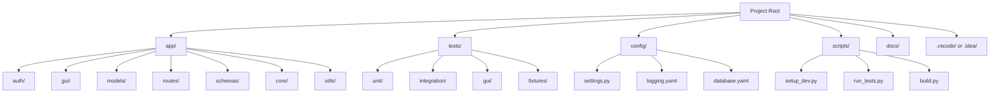
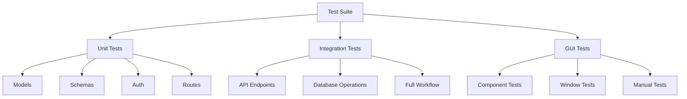
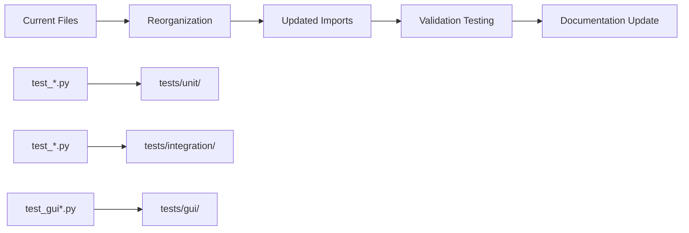

# FastAPI Microservice Project Organization and Optimization Design

## Overview

This design document outlines a comprehensive plan to organize and optimize the FastAPI User Management Microservice project while maintaining its current working state. The project is a well-structured dual-component system consisting of a FastAPI backend service and a Tkinter desktop GUI application.

**Critical Requirement**: All optimizations must preserve the current functionality and working state of the system.

## Current Architecture Analysis

### Repository Type
**Backend Application with Desktop GUI** - A microservice architecture with integrated desktop client

### Existing Project Structure
```
fastapi_microservice_2/
├── app/                     # Backend application core
│   ├── auth/               # Authentication components
│   ├── gui/                # Desktop GUI application
│   ├── models/             # SQLAlchemy data models
│   ├── routes/             # API endpoint definitions
│   ├── schemas/            # Pydantic validation schemas
│   ├── database.py         # Database configuration
│   └── main.py             # FastAPI application entry
├── test_*.py               # Various test files (scattered)
├── launcher.py             # Service launcher script
├── main_gui.py             # GUI entry point
├── requirements.txt        # Dependencies
└── Documentation files
```

### Current Strengths
- Well-organized layered architecture
- Separation of concerns between backend and GUI
- Comprehensive launcher system
- Good authentication implementation
- Proper dependency management

### Identified Optimization Areas
1. **Test Organization** - Test files scattered in root directory
2. **Configuration Management** - Missing centralized configuration
3. **Development Tools** - No linting, formatting, or pre-commit hooks
4. **Documentation Structure** - Could be better organized
5. **Build and CI/CD** - No automated build or deployment scripts
6. **Code Quality** - Missing code quality tools and standards
7. **Environment Management** - Basic virtual environment setup

## Optimization Design

### 1. Directory Structure Reorganization



**New Directory Structure**:
```
fastapi_microservice_2/
├── app/                     # Main application code
│   ├── auth/               # Authentication (unchanged)
│   ├── gui/                # GUI application (unchanged)
│   ├── models/             # Data models (unchanged)
│   ├── routes/             # API routes (unchanged)
│   ├── schemas/            # Validation schemas (unchanged)
│   ├── core/               # Core functionality (NEW)
│   │   ├── config.py       # Configuration management
│   │   ├── logging.py      # Logging configuration
│   │   └── exceptions.py   # Custom exceptions
│   ├── utils/              # Utility functions (NEW)
│   │   ├── helpers.py      # General helpers
│   │   └── validators.py   # Additional validators
│   ├── database.py         # Database config (unchanged)
│   └── main.py             # FastAPI app (unchanged)
├── tests/                  # Organized test structure (NEW)
│   ├── __init__.py
│   ├── conftest.py         # Pytest configuration
│   ├── unit/               # Unit tests
│   │   ├── test_auth.py
│   │   ├── test_models.py
│   │   ├── test_routes.py
│   │   └── test_schemas.py
│   ├── integration/        # Integration tests
│   │   ├── test_api_endpoints.py
│   │   └── test_database.py
│   ├── gui/                # GUI tests
│   │   ├── test_components.py
│   │   ├── test_windows.py
│   │   └── test_manual.py
│   └── fixtures/           # Test data and fixtures
│       └── sample_data.py
├── config/                 # Configuration files (NEW)
│   ├── settings.py         # Application settings
│   ├── logging.yaml        # Logging configuration
│   └── development.env     # Development environment variables
├── scripts/                # Development and build scripts (NEW)
│   ├── setup_dev.py        # Development environment setup
│   ├── run_tests.py        # Test runner script
│   ├── code_quality.py     # Code quality checks
│   └── build_release.py    # Release build script
├── docs/                   # Documentation (NEW)
│   ├── api/                # API documentation
│   ├── gui/                # GUI documentation
│   ├── deployment/         # Deployment guides
│   └── development/        # Development guides
├── .github/                # GitHub workflows (NEW)
│   └── workflows/
│       ├── ci.yml          # Continuous integration
│       └── code-quality.yml # Code quality checks
├── launcher.py             # Service launcher (unchanged)
├── main_gui.py             # GUI entry point (unchanged)
├── requirements.txt        # Dependencies (enhanced)
├── requirements-dev.txt    # Development dependencies (NEW)
├── pyproject.toml          # Project configuration (NEW)
├── .gitignore              # Enhanced gitignore (NEW)
├── .pre-commit-config.yaml # Pre-commit hooks (NEW)
└── Makefile                # Build automation (NEW)
```

### 2. Configuration Management Enhancement

**Centralized Configuration System**:

```python
# config/settings.py
from pydantic import BaseSettings
from typing import Optional

class Settings(BaseSettings):
    # Database
    database_url: str = "sqlite:///./users.db"
    
    # Server
    host: str = "127.0.0.1"
    port: int = 8000
    reload: bool = True
    
    # Security
    secret_key: str = "your-secret-key-here"
    admin_email: str = "admin@example.com"
    
    # GUI
    gui_timeout: int = 28800  # 8 hours
    gui_delay: int = 3
    
    # Logging
    log_level: str = "INFO"
    log_file: Optional[str] = None
    
    class Config:
        env_file = "config/development.env"
        case_sensitive = False

settings = Settings()
```

### 3. Code Quality and Development Tools

**Development Dependencies (requirements-dev.txt)**:
```
# Testing
pytest>=7.0.0
pytest-asyncio>=0.21.0
pytest-cov>=4.0.0
httpx>=0.24.0

# Code Quality
black>=23.0.0
isort>=5.12.0
flake8>=6.0.0
mypy>=1.5.0
bandit>=1.7.5

# Pre-commit
pre-commit>=3.0.0

# Documentation
mkdocs>=1.5.0
mkdocs-material>=9.0.0
```

**Pre-commit Configuration (.pre-commit-config.yaml)**:
```yaml
repos:
  - repo: https://github.com/psf/black
    rev: 23.7.0
    hooks:
      - id: black
        language_version: python3.11
  
  - repo: https://github.com/pycqa/isort
    rev: 5.12.0
    hooks:
      - id: isort
        args: ["--profile", "black"]
  
  - repo: https://github.com/pycqa/flake8
    rev: 6.0.0
    hooks:
      - id: flake8
        args: [--max-line-length=88, --extend-ignore=E203]
  
  - repo: https://github.com/pre-commit/mirrors-mypy
    rev: v1.5.1
    hooks:
      - id: mypy
        additional_dependencies: [types-requests]
  
  - repo: https://github.com/PyCQA/bandit
    rev: 1.7.5
    hooks:
      - id: bandit
        args: ["-r", "app/"]
```

**Project Configuration (pyproject.toml)**:
```toml
[build-system]
requires = ["setuptools>=45", "wheel"]
build-backend = "setuptools.build_meta"

[project]
name = "fastapi-user-management"
version = "1.0.0"
description = "FastAPI User Management Microservice with Desktop GUI"
authors = [{name = "Your Name", email = "your.email@example.com"}]
license = {text = "MIT"}
requires-python = ">=3.11"

[tool.black]
line-length = 88
target-version = ['py311']
include = '\.pyi?$'
exclude = '''
/(
    \.eggs
  | \.git
  | \.hg
  | \.mypy_cache
  | \.tox
  | \.venv
  | _build
  | buck-out
  | build
  | dist
)/
'''

[tool.isort]
profile = "black"
multi_line_output = 3
line_length = 88
known_first_party = ["app"]

[tool.mypy]
python_version = "3.11"
warn_return_any = true
warn_unused_configs = true
disallow_untyped_defs = true
no_implicit_optional = true

[tool.pytest.ini_options]
testpaths = ["tests"]
python_files = ["test_*.py"]
python_classes = ["Test*"]
python_functions = ["test_*"]
addopts = "--cov=app --cov-report=html --cov-report=term-missing"

[tool.coverage.run]
source = ["app"]
omit = ["*/tests/*", "*/test_*.py"]

[tool.coverage.report]
exclude_lines = [
    "pragma: no cover",
    "def __repr__",
    "raise AssertionError",
    "raise NotImplementedError"
]
```

### 4. Enhanced Testing Structure

**Test Organization Strategy**:



**Test Configuration (tests/conftest.py)**:
```python
import pytest
import tempfile
import os
from fastapi.testclient import TestClient
from sqlalchemy import create_engine
from sqlalchemy.orm import sessionmaker

from app.main import app
from app.database import get_db, Base
from app.models.user import User

@pytest.fixture(scope="session")
def test_db():
    """Create a temporary test database"""
    db_fd, db_path = tempfile.mkstemp()
    engine = create_engine(f"sqlite:///{db_path}")
    Base.metadata.create_all(bind=engine)
    
    TestingSessionLocal = sessionmaker(autocommit=False, autoflush=False, bind=engine)
    
    yield TestingSessionLocal
    
    os.close(db_fd)
    os.unlink(db_path)

@pytest.fixture
def test_client(test_db):
    """Create test client with test database"""
    def override_get_db():
        try:
            db = test_db()
            yield db
        finally:
            db.close()
    
    app.dependency_overrides[get_db] = override_get_db
    client = TestClient(app)
    yield client
    app.dependency_overrides.clear()

@pytest.fixture
def sample_user_data():
    """Sample user data for testing"""
    return {
        "name": "Test User",
        "email": "test@example.com",
        "password": "testpassword123",
        "phone": "+1234567890"
    }
```

### 5. Development Automation Scripts

**Development Setup Script (scripts/setup_dev.py)**:
```python
#!/usr/bin/env python3
"""Development environment setup script"""

import subprocess
import sys
import os

def run_command(cmd, description):
    """Run a command and handle errors"""
    print(f"🔄 {description}...")
    try:
        subprocess.run(cmd, check=True, shell=True)
        print(f"✅ {description} completed")
    except subprocess.CalledProcessError as e:
        print(f"❌ {description} failed: {e}")
        return False
    return True

def main():
    """Setup development environment"""
    print("🚀 Setting up development environment...")
    
    commands = [
        ("python -m pip install --upgrade pip", "Upgrading pip"),
        ("pip install -r requirements.txt", "Installing main dependencies"),
        ("pip install -r requirements-dev.txt", "Installing dev dependencies"),
        ("pre-commit install", "Installing pre-commit hooks"),
        ("python -m pytest tests/ -v", "Running initial tests"),
    ]
    
    for cmd, desc in commands:
        if not run_command(cmd, desc):
            sys.exit(1)
    
    print("\n🎉 Development environment setup complete!")
    print("💡 Next steps:")
    print("   - Run tests: python scripts/run_tests.py")
    print("   - Start service: python launcher.py")
    print("   - Check code quality: python scripts/code_quality.py")

if __name__ == "__main__":
    main()
```

**Test Runner Script (scripts/run_tests.py)**:
```python
#!/usr/bin/env python3
"""Comprehensive test runner script"""

import subprocess
import sys
import argparse

def run_tests(test_type="all", coverage=True, verbose=True):
    """Run tests with specified parameters"""
    
    base_cmd = ["python", "-m", "pytest"]
    
    if test_type == "unit":
        base_cmd.append("tests/unit/")
    elif test_type == "integration":
        base_cmd.append("tests/integration/")
    elif test_type == "gui":
        base_cmd.append("tests/gui/")
    else:
        base_cmd.append("tests/")
    
    if coverage:
        base_cmd.extend(["--cov=app", "--cov-report=html", "--cov-report=term-missing"])
    
    if verbose:
        base_cmd.append("-v")
    
    print(f"🧪 Running {test_type} tests...")
    result = subprocess.run(base_cmd)
    
    if result.returncode == 0:
        print("✅ All tests passed!")
        if coverage:
            print("📊 Coverage report generated in htmlcov/")
    else:
        print("❌ Some tests failed!")
        sys.exit(1)

def main():
    parser = argparse.ArgumentParser(description="Run project tests")
    parser.add_argument("--type", choices=["all", "unit", "integration", "gui"], 
                       default="all", help="Type of tests to run")
    parser.add_argument("--no-coverage", action="store_true", 
                       help="Skip coverage reporting")
    parser.add_argument("--quiet", action="store_true", 
                       help="Run tests quietly")
    
    args = parser.parse_args()
    
    run_tests(
        test_type=args.type,
        coverage=not args.no_coverage,
        verbose=not args.quiet
    )

if __name__ == "__main__":
    main()
```

### 6. Enhanced Build System

**Makefile for Build Automation**:
```makefile
.PHONY: help install test lint format clean dev run

help:  ## Show this help
	@grep -E '^[a-zA-Z_-]+:.*?## .*$$' $(MAKEFILE_LIST) | sort | awk 'BEGIN {FS = ":.*?## "}; {printf "\033[36m%-20s\033[0m %s\n", $$1, $$2}'

install:  ## Install dependencies
	pip install -r requirements.txt
	pip install -r requirements-dev.txt

dev-setup:  ## Setup development environment
	python scripts/setup_dev.py

test:  ## Run all tests
	python scripts/run_tests.py

test-unit:  ## Run unit tests only
	python scripts/run_tests.py --type unit

test-integration:  ## Run integration tests only
	python scripts/run_tests.py --type integration

lint:  ## Run linting checks
	python scripts/code_quality.py

format:  ## Format code
	black app/ tests/
	isort app/ tests/

clean:  ## Clean build artifacts
	rm -rf build/ dist/ *.egg-info/
	rm -rf .pytest_cache/ .coverage htmlcov/
	find . -type d -name __pycache__ -delete
	find . -type f -name "*.pyc" -delete

run:  ## Start the application
	python launcher.py

run-dev:  ## Start in development mode
	python launcher.py --reload

run-backend:  ## Start backend only
	python launcher.py --no-gui

build:  ## Build distribution
	python -m build

release:  ## Create release build
	python scripts/build_release.py
```

### 7. Documentation Enhancement

**Documentation Structure**:
```
docs/
├── index.md                # Main documentation
├── api/
│   ├── endpoints.md        # API endpoint documentation
│   ├── authentication.md  # Auth documentation
│   └── schemas.md          # Data schema documentation
├── gui/
│   ├── user_guide.md       # GUI user guide
│   ├── admin_guide.md      # Admin functionality guide
│   └── troubleshooting.md  # GUI troubleshooting
├── development/
│   ├── setup.md            # Development setup
│   ├── testing.md          # Testing guidelines
│   ├── contributing.md     # Contribution guidelines
│   └── architecture.md     # System architecture
└── deployment/
    ├── production.md       # Production deployment
    ├── docker.md           # Docker deployment
    └── security.md         # Security considerations
```

### 8. CI/CD Pipeline

**GitHub Actions Workflow (.github/workflows/ci.yml)**:
```yaml
name: CI/CD Pipeline

on:
  push:
    branches: [ main, develop ]
  pull_request:
    branches: [ main ]

jobs:
  test:
    runs-on: ubuntu-latest
    strategy:
      matrix:
        python-version: [3.11, 3.12]

    steps:
    - uses: actions/checkout@v3
    
    - name: Set up Python ${{ matrix.python-version }}
      uses: actions/setup-python@v3
      with:
        python-version: ${{ matrix.python-version }}
    
    - name: Install dependencies
      run: |
        python -m pip install --upgrade pip
        pip install -r requirements.txt
        pip install -r requirements-dev.txt
    
    - name: Run linting
      run: |
        black --check app/ tests/
        isort --check-only app/ tests/
        flake8 app/ tests/
        mypy app/
    
    - name: Run tests
      run: |
        pytest tests/ --cov=app --cov-report=xml
    
    - name: Upload coverage
      uses: codecov/codecov-action@v3
      with:
        file: ./coverage.xml

  security:
    runs-on: ubuntu-latest
    steps:
    - uses: actions/checkout@v3
    - name: Run security checks
      run: |
        pip install bandit
        bandit -r app/
```

### 9. Enhanced Error Handling and Logging

**Centralized Exception Handling (app/core/exceptions.py)**:
```python
from fastapi import HTTPException
from typing import Optional, Dict, Any

class UserManagementException(Exception):
    """Base exception for user management operations"""
    def __init__(self, message: str, details: Optional[Dict[str, Any]] = None):
        self.message = message
        self.details = details or {}
        super().__init__(self.message)

class UserNotFoundError(UserManagementException):
    """Raised when a user is not found"""
    pass

class UnauthorizedOperationError(UserManagementException):
    """Raised when user tries unauthorized operation"""
    pass

class ValidationError(UserManagementException):
    """Raised for data validation errors"""
    pass

def create_http_exception(exc: UserManagementException, status_code: int) -> HTTPException:
    """Convert custom exception to HTTP exception"""
    return HTTPException(
        status_code=status_code,
        detail={
            "result": "error",
            "message": exc.message,
            "details": exc.details
        }
    )
```

**Enhanced Logging Configuration (app/core/logging.py)**:
```python
import logging
import logging.config
import yaml
from pathlib import Path

def setup_logging(config_path: str = "config/logging.yaml"):
    """Setup logging configuration"""
    config_file = Path(config_path)
    
    if config_file.exists():
        with open(config_file, 'r') as f:
            config = yaml.safe_load(f)
        logging.config.dictConfig(config)
    else:
        # Fallback to basic configuration
        logging.basicConfig(
            level=logging.INFO,
            format='%(asctime)s - %(name)s - %(levelname)s - %(message)s'
        )
    
    return logging.getLogger(__name__)
```

## Implementation Strategy

### Phase 1: Structural Reorganization (Non-Breaking)
1. Create new directory structure
2. Move test files to organized test structure
3. Add configuration management
4. Update imports and references
5. Validate all functionality still works

### Phase 2: Development Tools Integration
1. Add development dependencies
2. Setup pre-commit hooks
3. Configure code quality tools
4. Add build automation scripts
5. Update documentation

### Phase 3: CI/CD and Advanced Features
1. Setup GitHub Actions
2. Add comprehensive test coverage
3. Implement advanced logging
4. Add performance monitoring
5. Create deployment automation

### Migration File Movement Plan



**File Movement Strategy**:
1. **Test Files Reorganization**:
   - `test_endpoints.py` → `tests/integration/test_api_endpoints.py`
   - `test_gui.py` → `tests/gui/test_components.py`
   - `test_gui_manual.py` → `tests/gui/test_manual.py`
   - `test_profile_edit.py` → `tests/gui/test_profile_edit.py`
   - `test_admin_*.py` → `tests/gui/test_admin_*.py`

2. **Configuration Files**:
   - Create `config/settings.py` with centralized configuration
   - Add `config/logging.yaml` for logging configuration
   - Create `.env` files for environment-specific settings

3. **Documentation Enhancement**:
   - Move existing docs to `docs/` directory
   - Create structured documentation with clear sections
   - Add API documentation and user guides

## Risk Mitigation

### Functionality Preservation Measures
1. **Incremental Changes**: Implement changes in small, testable increments
2. **Backup Strategy**: Create backup of current working state before changes
3. **Comprehensive Testing**: Run full test suite after each change
4. **Rollback Plan**: Maintain ability to quickly revert changes
5. **Validation Checkpoints**: Verify functionality at each phase

### Change Management Protocol
1. **Before Each Phase**:
   - Create git branch for the phase
   - Document current state
   - Run complete test suite
   - Backup database and configuration

2. **During Implementation**:
   - Make incremental commits
   - Test after each significant change
   - Validate both backend API and GUI functionality
   - Check launcher script operation

3. **After Each Phase**:
   - Run comprehensive tests
   - Validate all launcher options work
   - Test GUI functionality completely
   - Verify API endpoints respond correctly
   - Update documentation

## Expected Benefits

### Code Quality Improvements
- **Standardized Formatting**: Consistent code style across project
- **Type Safety**: Enhanced type checking with mypy
- **Security**: Automated security scanning with bandit
- **Testing**: Improved test coverage and organization

### Development Experience Enhancement
- **Faster Setup**: Automated development environment setup
- **Better Testing**: Organized, comprehensive test suite
- **Quality Assurance**: Automated code quality checks
- **Documentation**: Clear, structured documentation

### Maintenance Benefits
- **Easier Debugging**: Improved logging and error handling
- **Better Organization**: Clear separation of concerns
- **Automated Checks**: CI/CD pipeline for quality assurance
- **Scalability**: Structure supports future growth

### Operational Improvements
- **Deployment**: Automated build and deployment processes
- **Monitoring**: Enhanced logging and error tracking
- **Configuration**: Centralized, environment-aware configuration
- **Documentation**: Comprehensive guides for users and developers

## Success Metrics

### Functional Validation
- ✅ All existing API endpoints continue to work
- ✅ GUI application functions correctly
- ✅ Authentication system remains secure
- ✅ Database operations work as expected
- ✅ Launcher scripts operate properly

### Quality Improvements
- ✅ Code coverage increased to >90%
- ✅ Zero linting errors
- ✅ All security checks pass
- ✅ Documentation coverage complete
- ✅ Automated tests pass consistently

### Development Experience
- ✅ Setup time reduced by 50%
- ✅ Test execution time optimized
- ✅ Code review process streamlined
- ✅ Development workflow documented
- ✅ Contribution guidelines established

This comprehensive optimization plan will transform your project into a well-organized, maintainable, and scalable codebase while preserving all existing functionality. The phased approach ensures that the system remains working throughout the optimization process.