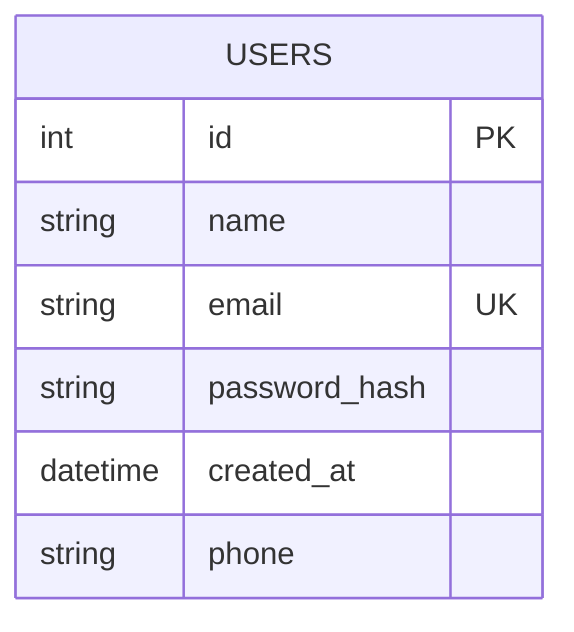
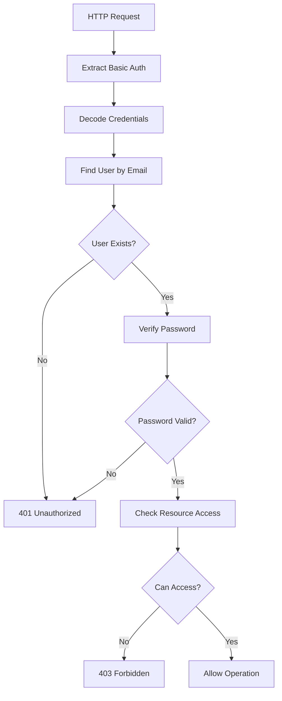

# FastAPI User Management Microservice Design

## Overview

Данный документ описывает дизайн микросервиса для управления пользователями на базе FastAPI с поддержкой CRUD операций и безопасной аутентификацией через HTTP Basic Auth. Микросервис использует SQLite в качестве базы данных и SQLAlchemy как ORM.

## Architecture

### Technology Stack
- **Framework**: FastAPI
- **Database**: SQLite
- **ORM**: SQLAlchemy
- **Authentication**: HTTP Basic Auth
- **Password Hashing**: bcrypt/passlib
- **Validation**: Pydantic

### Project Structure
```
fastapi_microservice_2/
├── app/
│   ├── __init__.py
│   ├── main.py
│   ├── database.py
│   ├── models/
│   │   ├── __init__.py
│   │   └── user.py
│   ├── schemas/
│   │   ├── __init__.py
│   │   └── user.py
│   ├── auth/
│   │   ├── __init__.py
│   │   └── basic_auth.py
│   └── routes/
│       ├── __init__.py
│       └── users.py
├── requirements.txt
└── users.db (создается автоматически)
```

## Data Models & ORM Mapping

### User Model (SQLAlchemy)

```python
class User(Base):
    __tablename__ = "users"
    
    id = Column(Integer, primary_key=True, index=True)
    name = Column(String, nullable=False)
    email = Column(String, unique=True, index=True, nullable=False)
    password_hash = Column(String, nullable=False)
    created_at = Column(DateTime, default=datetime.utcnow)
    phone = Column(String, nullable=True)
```

### Database Schema


### Field Specifications
- **id**: INTEGER PRIMARY KEY AUTOINCREMENT
- **name**: VARCHAR NOT NULL
- **email**: VARCHAR UNIQUE NOT NULL (используется как логин)
- **password_hash**: VARCHAR NOT NULL (bcrypt hash)
- **created_at**: DATETIME DEFAULT CURRENT_TIMESTAMP
- **phone**: VARCHAR NULL

## API Endpoints Reference

### 1. GET /users
**Описание**: Получить список всех пользователей

**Request Headers**:
```
Authorization: Basic <base64(email:password)>
```

**Response Format**:
```json
{
    "result": "ok",
    "users": [
        {
            "id": 1,
            "name": "John Doe",
            "email": "john@example.com",
            "created_at": "2024-01-01T12:00:00",
            "phone": "+7 900 100-20-30"
        }
    ]
}
```

### 2. POST /users
**Описание**: Создать нового пользователя

**Request Body**:
```json
{
    "name": "John Doe",
    "email": "john@example.com",
    "password": "SecurePassword123",
    "phone": "+7 900 100-20-30"
}
```

**Response Format**:
```json
{
    "result": "ok",
    "user": {
        "id": 1,
        "name": "John Doe",
        "email": "john@example.com",
        "created_at": "2024-01-01T12:00:00",
        "phone": "+7 900 100-20-30"
    }
}
```

### 3. GET /users/{user_id}
**Описание**: Получить информацию о пользователе по ID

**Path Parameters**:
- `user_id`: integer

**Request Headers**:
```
Authorization: Basic <base64(email:password)>
```

**Response Format**:
```json
{
    "result": "ok",
    "user": {
        "id": 1,
        "name": "John Doe",
        "email": "john@example.com",
        "created_at": "2024-01-01T12:00:00",
        "phone": "+7 900 100-20-30"
    }
}
```

### 4. DELETE /users/{user_id}
**Описание**: Удалить пользователя по ID (только свой профиль)

**Path Parameters**:
- `user_id`: integer

**Authentication Requirements**:
- Пользователь может удалить только свой собственный профиль

**Response Format**:
```json
{
    "result": "ok",
    "message": "Пользователь успешно удален"
}
```

### 5. PUT /api/user/profile
**Описание**: Обновить свои личные данные

**Request Headers**:
```
Authorization: Basic <base64(email:password)>
```

**Request Body**:
```json
{
    "name": "Новое имя",
    "email": "new@email.example",
    "phone": "+7 900 100-20-30"
}
```

**Response Format**:
```json
{
    "result": "ok",
    "user": {
        "name": "Новое имя",
        "email": "new@email.example",
        "phone": "+7 900 100-20-30"
    }
}
```

### 6. PUT /api/user/password
**Описание**: Сменить свой пароль

**Request Headers**:
```
Authorization: Basic <base64(email:current_password)>
```

**Request Body**:
```json
{
    "new_password": "Qwerty1234",
    "new_password_repeat": "Qwerty1234"
}
```

**Response Format**:
```json
{
    "result": "ok",
    "message": "Пароль успешно изменён"
}
```

### 7. POST /users/{user_id}/change-password
**Описание**: Сменить пароль пользователя по ID (административная функция)

**Path Parameters**:
- `user_id`: integer

**Request Body**:
```json
{
    "new_password": "NewSecurePassword123"
}
```

**Response Format**:
```json
{
    "result": "ok",
    "message": "Пароль пользователя успешно изменён"
}
```

## Authentication Requirements

### HTTP Basic Authentication
- **Method**: HTTP Basic Auth
- **Format**: `Authorization: Basic <base64(email:password)>`
- **Login Field**: email (unique identifier)
- **Password**: plain text password (проверяется против хеша)

### Security Rules
1. Пользователь может изменять только свои данные
2. Пользователь может удалять только свой профиль
3. Административные операции (change-password by ID) требуют специальных прав
4. Все пароли хранятся только в виде bcrypt хешей

## Business Logic Layer

### User Management Service

#### Password Security
```python
class PasswordService:
    @staticmethod
    def hash_password(password: str) -> str
    
    @staticmethod
    def verify_password(plain_password: str, hashed_password: str) -> bool
```

#### Authentication Service
```python
class AuthService:
    @staticmethod
    def authenticate_user(email: str, password: str) -> User | None
    
    @staticmethod
    def get_current_user(credentials: HTTPBasicCredentials) -> User
```

#### User Operations Service
```python
class UserService:
    @staticmethod
    def create_user(user_data: UserCreate) -> User
    
    @staticmethod
    def get_user_by_id(user_id: int) -> User | None
    
    @staticmethod
    def get_user_by_email(email: str) -> User | None
    
    @staticmethod
    def update_user_profile(user: User, update_data: UserProfileUpdate) -> User
    
    @staticmethod
    def change_user_password(user: User, new_password: str) -> bool
    
    @staticmethod
    def delete_user(user_id: int) -> bool
```

### Authorization Logic


## Error Handling

### HTTP Status Codes
- **200 OK**: Successful operation
- **201 Created**: User successfully created
- **400 Bad Request**: Invalid input data
- **401 Unauthorized**: Invalid credentials
- **403 Forbidden**: Insufficient permissions
- **404 Not Found**: User not found
- **409 Conflict**: Email already exists
- **422 Unprocessable Entity**: Validation errors

### Error Response Format
```json
{
    "result": "error",
    "message": "Описание ошибки"
}
```

### Common Error Messages
- "Неверные логин или пароль"
- "Пользователь не найден"
- "Email уже используется"
- "Пароли не совпадают"
- "Недостаточно прав для выполнения операции"
- "Некорректный формат email"
- "Пароль должен содержать минимум 8 символов"

## Validation Rules

### Email Validation
- Формат: стандартный email regex
- Уникальность: проверка в базе данных
- Обязательное поле

### Password Validation
- Минимальная длина: 8 символов
- Должен содержать буквы и цифры
- Хешируется перед сохранением

### Phone Validation
- Опциональное поле
- Формат: российский номер телефона
- Regex: `^(\+7|8)?[\s\-]?\(?[489][0-9]{2}\)?[\s\-]?[0-9]{3}[\s\-]?[0-9]{2}[\s\-]?[0-9]{2}$`

### Name Validation
- Обязательное поле
- Минимум 2 символа
- Максимум 100 символов

## Database Configuration

### SQLite Setup
```python
DATABASE_URL = "sqlite:///./users.db"
engine = create_engine(DATABASE_URL, connect_args={"check_same_thread": False})
SessionLocal = sessionmaker(autocommit=False, autoflush=False, bind=engine)
Base = declarative_base()
```

### Database Initialization
```python
# В main.py
@app.on_event("startup")
def create_tables():
    Base.metadata.create_all(bind=engine)
```

### Connection Management
```python
def get_db():
    db = SessionLocal()
    try:
        yield db
    finally:
        db.close()
```

## Testing Strategy

### Unit Tests
- Password hashing/verification
- User model validation
- Authentication logic
- Business logic services

### Integration Tests
- API endpoints functionality
- Database operations
- Authentication flow
- Error handling

### Test Data Setup
```python
@pytest.fixture
def test_user():
    return {
        "name": "Test User",
        "email": "test@example.com",
        "password": "TestPassword123",
        "phone": "+7 900 100-20-30"
    }
```

### Test Cases
1. Создание пользователя с валидными данными
2. Создание пользователя с существующим email
3. Аутентификация с корректными учетными данными
4. Аутентификация с некорректными учетными данными
5. Обновление профиля собственным пользователем
6. Попытка обновления чужого профиля
7. Смена пароля с корректным подтверждением
8. Смена пароля с некорректным подтверждением
9. Удаление собственного профиля
10. Попытка удаления чужого профиля