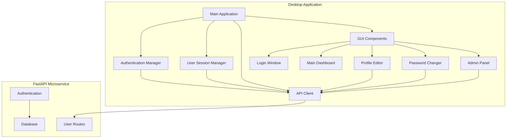
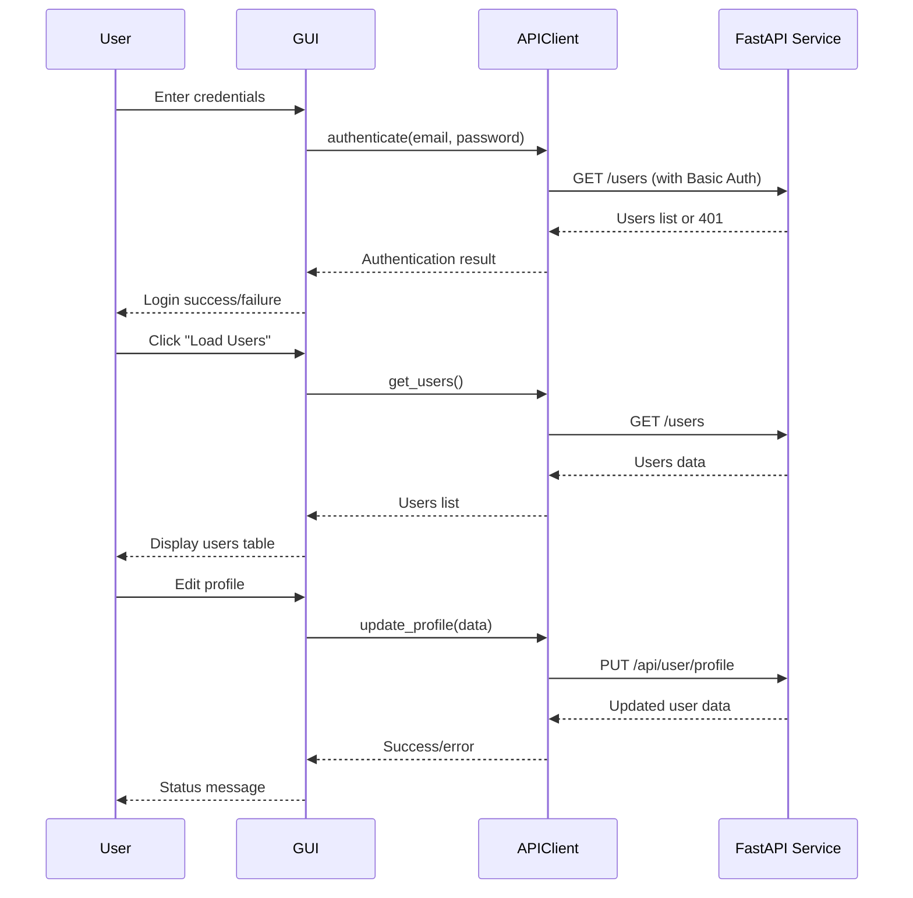

# User Interface Implementation Design

## Overview

This document outlines the design for a desktop GUI application that provides a user-friendly interface for interacting with the existing FastAPI user management microservice. The application will be built using Python with Tkinter as the GUI framework, offering authentication, user management, and administrative capabilities.

## Technology Stack & Dependencies

- **GUI Framework**: Tkinter (Python's built-in GUI library)
- **HTTP Client**: requests library (already in requirements.txt)
- **JSON Handling**: json (built-in Python module)
- **Base64 Encoding**: base64 (for HTTP Basic Auth header)
- **Date/Time**: datetime (for timestamp formatting)
- **Threading**: threading (for non-blocking API calls)

## Architecture



## Component Architecture

### Core Components

#### 1. MainApplication
- **Purpose**: Entry point and main window controller
- **Responsibilities**:
  - Initialize GUI framework
  - Manage window states
  - Coordinate between components
  - Handle application lifecycle

#### 2. APIClient
- **Purpose**: Centralized HTTP communication with FastAPI service
- **Responsibilities**:
  - HTTP Basic Authentication header management
  - Request/response handling
  - Error handling and status code interpretation
  - Base URL configuration

**Key Methods**:
```
authenticate(email, password) -> bool
get_users() -> List[User]
update_profile(user_data) -> Response
change_password(new_password, repeat_password) -> Response
admin_delete_user(user_id) -> Response
admin_change_password(user_id, new_password) -> Response
```

#### 3. AuthenticationManager
- **Purpose**: Handle user authentication state
- **Responsibilities**:
  - Store current user credentials securely
  - Validate login attempts
  - Manage session state
  - Handle logout functionality

#### 4. UserSessionManager
- **Purpose**: Manage current user session data
- **Responsibilities**:
  - Store current user information
  - Track user permissions (admin/regular)
  - Session timeout handling
  - User data caching

### GUI Components

#### 1. LoginWindow
- **Components**:
  - Email entry field (StringVar)
  - Password entry field (StringVar, show="*")
  - Login button
  - Status label for error messages
  - Window centering and fixed size

**Layout Structure**:
```
┌─────────────────────────────────┐
│          Login Window           │
├─────────────────────────────────┤
│ Email:    [________________]    │
│ Password: [________________]    │
│                                 │
│        [    Login    ]          │
│                                 │
│     Status: Error message       │
└─────────────────────────────────┘
```

#### 2. MainDashboard
- **Components**:
  - User list display (Treeview widget)
  - Refresh users button
  - Profile edit button
  - Change password button
  - Admin panel button (conditional)
  - Logout button

**User List Columns**:
- ID
- Name
- Email
- Phone
- Created At

**Layout Structure**:
```
┌─────────────────────────────────────────────────────┐
│                Main Dashboard                       │
├─────────────────────────────────────────────────────┤
│ [Refresh] [Edit Profile] [Change Password] [Logout] │
│ [Admin Panel] (if admin)                           │
├─────────────────────────────────────────────────────┤
│ │ID│Name      │Email          │Phone    │Created  │ │
│ │1 │John Doe  │john@email.com │123-456  │2024-01  │ │
│ │2 │Jane Smith│jane@email.com │789-012  │2024-01  │ │
│ │...                                               │ │
└─────────────────────────────────────────────────────┘
```

#### 3. ProfileEditor
- **Components**:
  - Name entry field (pre-filled)
  - Email entry field (pre-filled)
  - Phone entry field (pre-filled)
  - Save button
  - Cancel button
  - Status label

**Validation**:
- Email format validation
- Required field validation
- Real-time feedback

#### 4. PasswordChanger
- **Components**:
  - New password entry (show="*")
  - Repeat password entry (show="*")
  - Save button
  - Cancel button
  - Status label

**Validation**:
- Password confirmation matching
- Minimum password length (if required)

#### 5. AdminPanel
- **Components**:
  - User selection dropdown/list
  - Delete user button
  - Change user password section
  - New password entry
  - Confirm password entry
  - Change password button

**Access Control**:
- Only visible for admin@example.com
- Additional confirmation dialogs for destructive actions

## API Integration Layer

### HTTP Basic Authentication
```
Authorization: Basic base64(email:password)
```

### API Endpoints Mapping

| GUI Action | HTTP Method | Endpoint | Response Handling |
|------------|-------------|----------|-------------------|
| Login | GET | /users | Authentication validation |
| Load Users | GET | /users | Display in table |
| Update Profile | PUT | /api/user/profile | Success/error feedback |
| Change Password | PUT | /api/user/password | Success/error feedback |
| Admin Delete User | DELETE | /users/{user_id} | Confirmation dialog |
| Admin Change Password | POST | /users/{user_id}/change-password | Success/error feedback |

### Error Handling Strategy

| HTTP Status | GUI Response |
|-------------|--------------|
| 200/201 | Success message |
| 401 | "Неверный логин или пароль" |
| 403 | "Недостаточно прав" |
| 404 | "Пользователь не найден" |
| 409 | "Email уже используется" |
| 422 | Validation error details |
| 500+ | "Ошибка сервера" |

## Data Flow Architecture



## State Management

### Application States
- **Unauthenticated**: Show login window only
- **Authenticated Regular User**: Show dashboard with user functions
- **Authenticated Admin User**: Show dashboard with admin functions

### Session Data
```python
SessionData = {
    'user_id': int,
    'name': str,
    'email': str,
    'phone': str,
    'is_admin': bool,
    'auth_header': str,  # Base64 encoded credentials
    'last_activity': datetime
}
```

## Security Considerations

### Credential Storage
- Store credentials only in memory during session
- Clear sensitive data on logout
- No persistent credential storage

### Network Security
- All communication over HTTP Basic Auth
- Validate server responses
- Handle network timeouts gracefully

### Input Validation
- Client-side validation for immediate feedback
- Server-side validation enforcement
- XSS prevention in user inputs

## Threading Architecture

### Background Operations
- API calls on separate threads to prevent GUI freezing
- Use threading.Thread for HTTP requests
- Callback mechanisms for UI updates

### Thread Safety
- Queue-based communication between threads
- GUI updates only on main thread
- Proper exception handling in worker threads

## Error Handling & User Feedback

### User-Friendly Messages
| Technical Error | User Message |
|----------------|--------------|
| Connection timeout | "Не удается подключиться к серверу" |
| Invalid JSON response | "Ошибка обработки данных" |
| Network error | "Проблема с сетевым соединением" |

### Visual Feedback
- Loading indicators during API calls
- Color-coded status messages (green/red)
- Disabled buttons during operations
- Progress indicators for long operations

## Testing Strategy

### Unit Testing Components
- APIClient methods with mock responses
- Authentication logic validation
- Input validation functions
- Error handling scenarios

### Integration Testing
- Full authentication flow
- CRUD operations end-to-end
- Admin functionality verification
- Error response handling

### Manual Testing Scenarios
- Login with valid/invalid credentials
- Network disconnection handling
- Server error responses
- Admin vs regular user permissions

## Deployment Considerations

### Requirements Addition
Add to requirements.txt:
```
tkinter (built-in, no installation needed)
```

### Application Structure
```
app/
├── gui/
│   ├── __init__.py
│   ├── main_app.py
│   ├── windows/
│   │   ├── login_window.py
│   │   ├── main_dashboard.py
│   │   ├── profile_editor.py
│   │   ├── password_changer.py
│   │   └── admin_panel.py
│   ├── components/
│   │   ├── api_client.py
│   │   ├── auth_manager.py
│   │   └── session_manager.py
│   └── utils/
│       ├── validators.py
│       └── helpers.py
└── main_gui.py  # Entry point
```

### Configuration
- API base URL configuration
- Default window sizes and positions
- Color scheme and styling constants

### Distribution
- Single executable using PyInstaller (optional)
- Virtual environment setup instructions
- Clear installation and running procedures